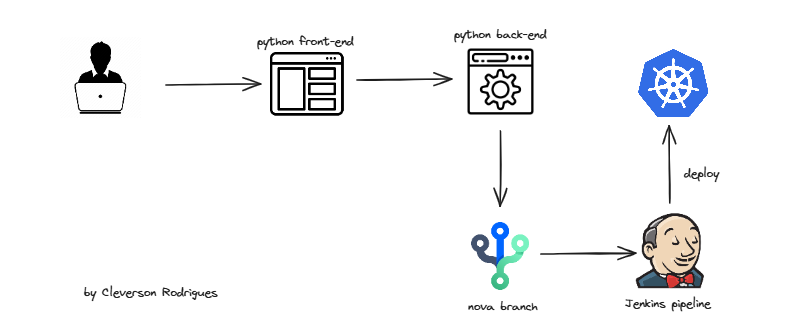

# Introduction
The premise of this project consists of a simple frontend that allows users to interact with a FastAPI backend to create new branches in BitBucket, trigger the Jenkins pipeline, and deploy on Kubernetes (k8s).
# Diagram
